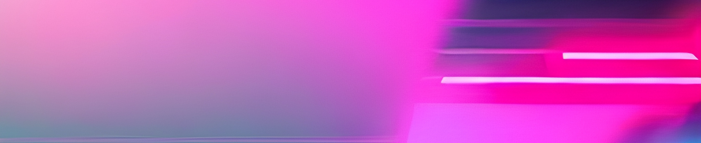

# Etch A Sketch: Synthwave

Welcome to the Etch A Sketch! This web application provides a synthwave aesthetic where users can interact with a square grid by sliding their cursor. It offers several features:

### Check It Out!

Try out the synthwave experience [here](https://haxaru.github.io/etch-a-sketch/)!

## Features

- **Synthwave Aesthetic:** Enjoy neon colors that glow, creating a vibrant visual experience.
- **Reset Button:** Easily return to a new 16 by 16 grid to start fresh.
- **Rainbow Button:** Generates a random color along with a random glow effect for added variety and fun.
- **Size Button:** Allows users to input grid sizes ranging between 2 and 100.

---

## 

## Usage

1. Move your cursor over the grid to draw.
2. Use the provided buttons to reset the grid, change colors, and adjust size.

## Inspiration Credit

This Etch A Sketch project is inspired by the synthwave aesthetic.
Credits to [Robb Owen](https://marketplace.visualstudio.com/items?itemName=RobbOwen.synthwave-vscode) for the inspiration behind the aesthetic.
